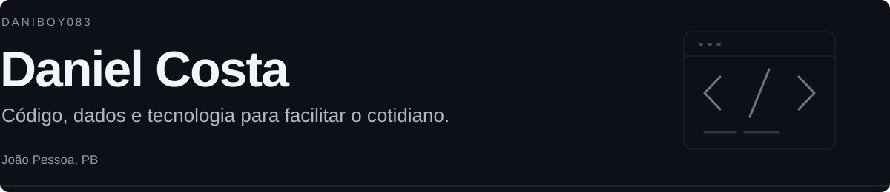

<picture>
  <source media="(max-width: 600px)" srcset="./assets/profile-header-mobile.svg">
  
</picture>

**Desenvolvedor Full Stack · Analista de Dados · Consultor em Tecnologia**

[Portfólio ↗](https://devthreebydanielcosta.vercel.app) &nbsp; · &nbsp; [LinkedIn ↗](https://www.linkedin.com/in/daniel-costa-62681132b/) &nbsp; · &nbsp; [Instagram ↗](https://www.instagram.com/dani_boy083_/)

## Sobre mim

Estudo **Ciências da Computação** e trabalho com **desenvolvimento Full Stack como freelancer**. Gosto de entender o problema de perto e construir algo que faça sentido para quem vai usar.

Também atuo como assessor e consultor de tecnologia na **OSC AC Social**, entre suporte técnico, bancos de dados, análise de dados e desenvolvimento.

Como pessoa com deficiência física, a **acessibilidade faz parte do meu olhar** sobre tecnologia. Quero que as soluções que construo ajudem as pessoas a se comunicar, se organizar e ter mais autonomia no cotidiano.

## No meu dia a dia

- **Interfaces** — React, TypeScript e Next.js.
- **Desenvolvimento** — Java e C.
- **Dados** — PostgreSQL e Python.
- **Consultoria** — suporte técnico, organização de processos e orientação tecnológica.

## Entre um commit e outro

---

Aberto a oportunidades, projetos freelance e colaborações. **Vamos construir algo útil?**
